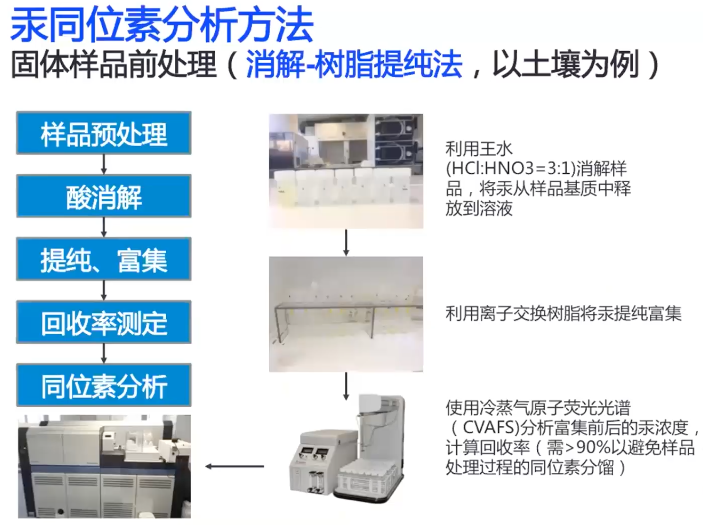
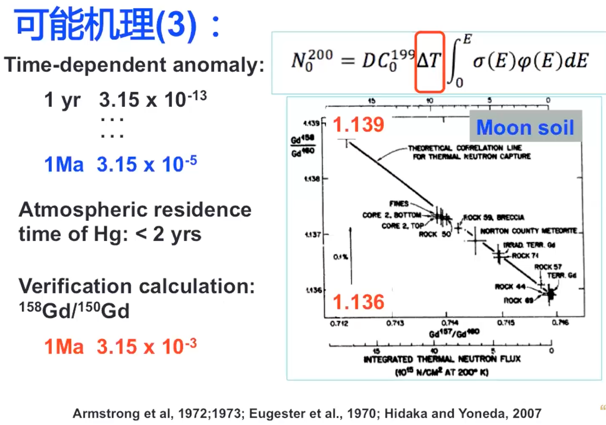
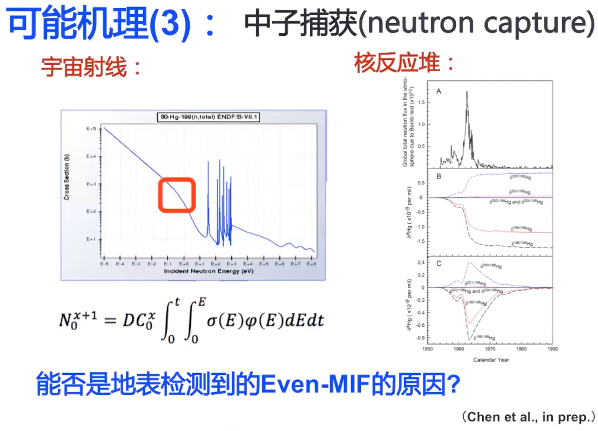
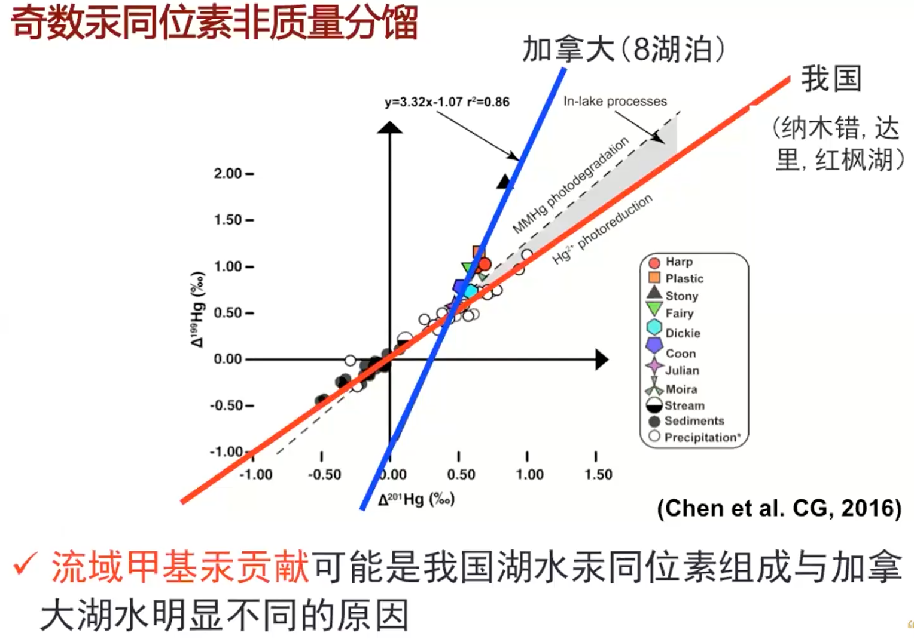

非传统稳定同位素暑期学校_陈玖斌_异常的汞同位素非质量分馏

## 背景介绍

有毒的是其有机形态——甲基汞，甲基汞在生物中有累积效应，所以开展其环境研究。

奇偶同位素非质量分馏

计算简单，但是产生的机制和过程十分复杂和重要。

如果偏离了质量分馏线，那么就说具有了非质量分馏。

## 分析方法

## 奇数MIF

物理、化学、生物都能产生质量分馏；但是只有少数特殊的过程才能产生明显的奇数汞同位素非质量分馏（光参与才行）

核的大小，核磁效应

## 偶数MIF

如果是拖尾，二者应该成正相关关系

## 应用范例

雾霾颗粒溯源：二次、原位排放（金属同位素不受二次来源干扰）

